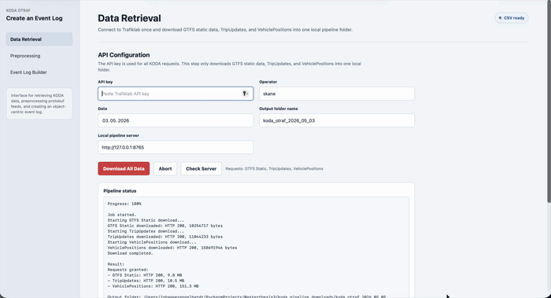

# GTFS2OCEL

Welcome to **GTFS2OCEL**, a transformation tool for generating object-centric event logs (OCEL 2.0) from GTFS Schedule and GTFS-Realtime data. The tool retrieves public transport data from the **KODA** platform, preprocesses the GTFS-Realtime snapshots, enriches the data with operational attributes, and transforms the prepared data into sustainability-oriented OCELs for object-centric process mining.

GTFS2OCEL provides the following main features:

* Retrieving GTFS Schedule and GTFS-Realtime data from the KODA platform
* Preprocessing GTFS-Realtime protobuf snapshots into a consolidated tabular representation
* Enriching the prepared data with operational attributes such as occupancy, speed, travel duration, and traveled distance
* Transforming the enriched GTFS data into OCEL 2.0 event logs
* Exporting the generated OCELs for further analysis in object-centric process mining and sustainability applications

The project consists of:

* A **Python** backend implementing the complete data retrieval, preprocessing, enrichment, and GTFS-to-OCEL transformation pipeline
* An **HTML** user interface for configuring the transformation pipeline and generating OCELs


# KODA Pipeline

Local pipeline for KODA data retrieval, GTFS/GTFS-RT preprocessing, and OCEL event log creation.

## Project Structure

```text
src/
  backend/
    koda_pipeline_server.py
    build_vehicle_positions_series.py
    KODA.py
    KODA_Robust.py
  frontend/
    koda_demo_frontend.html
```

Generated downloads and CSV outputs are written to:

```text
koda_pipeline_downloads/
```

## Setup On A New Computer

Use Python 3.11 or newer.

```bash
python -m venv .venv
source .venv/bin/activate
python -m pip install -U pip
python -m pip install -e .
```

On Windows PowerShell, activate with:

```powershell
.\.venv\Scripts\Activate.ps1
```

## Start The Local Pipeline Server

After setup:

```bash
koda-pipeline
```

Or without the console command:

```bash
python src/backend/koda_pipeline_server.py
```

Then open:

```text
http://127.0.0.1:8765/
```

## Installation And Run With Docker

Docker is the recommended way to run the pipeline on another computer. It avoids manual Python setup and installs the required runtime inside a container.

### Requirements

Install Docker Desktop and make sure it is running:

- macOS/Windows: <https://www.docker.com/products/docker-desktop/>
- Linux: install Docker Engine and Docker Compose

### Download The Project

Clone this repository:

```bash
git clone <REPOSITORY_URL>
cd <PROJECT_FOLDER>
```

If you downloaded the repository as a ZIP file, unzip it and open the project folder in a terminal.

### Start The Pipeline

Build and start the container:

```bash
docker compose up --build
```

Then open the frontend in your browser:

```text
http://127.0.0.1:8765/
```

### Use The Pipeline

1. Open the `Data Retrieval` section.
2. Enter the operator, date, and your KODA/Trafiklab API key.
3. Download GTFS Static, TripUpdates, and VehiclePositions.
4. Open the `Preprocessing` section.
5. Select the created pipeline folder and run preprocessing.
6. Open the `Event Builder` section.
7. Select the same pipeline folder and build the OCEL event log.

### Where Data Is Stored

Downloaded and generated data is stored locally on your computer in:

```text
koda_pipeline_downloads/
```

The Docker container writes to this folder through the volume mount in `docker-compose.yml`:

```text
./koda_pipeline_downloads:/app/koda_pipeline_downloads
```

This means the data remains on your computer even after the Docker container is closed.

## External Tool

Preprocessing downloaded KODA realtime archives requires `7z` if the API returns `.7z` archives.

On macOS with Homebrew:

```bash
brew install p7zip
```

On Windows, install 7-Zip and make sure `7z` is available on `PATH`.

## Pipeline Notes

- Data Retrieval downloads GTFS Static, TripUpdates, and VehiclePositions into one pipeline folder.
- Preprocessing creates `all_trip_updates.csv` and `all_vehicle_positions.csv`.
- VehiclePositions can be processed in three modes:
  - `Fastlane`: uses selected seconds of each minute, for example every 10 seconds. This creates smaller VehiclePositions CSV files and is faster.
  - `Complete`: uses all available VehiclePositions updates for every second. This is more complete, but can cause performance problems for large operators.
  - `Ultra Fastlane`: uses a compact trip-level occupancy table when the occupancy value does not change within a trip. Instead of joining the large VehiclePositions table, the event builder joins a much smaller table with one occupancy value per trip.
- `Event Builder` uses `KODA.py`.
- `Event Builder+` uses `KODA_Robust.py`.
